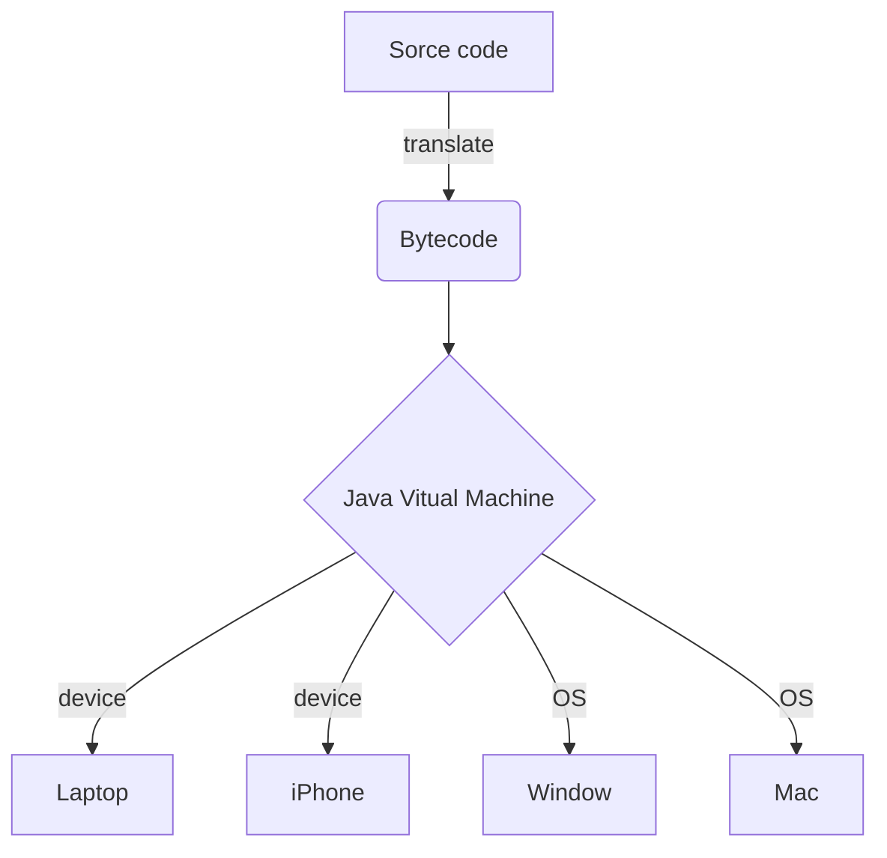

# JAVA - THE FIRST LOOK
> I am Nayn, a beginner in everything about coding, and yes in case you ask - I DONT KNOW ANYTHING ABOUT JAVA, and thanks to my coding club - ProPTIT, I can learn what Java is. This repository describes my very first look at Java, how I learn things in this field and whether I can deal with those exercises WITHOUT vibe coding (I PROMISE). So if you (maybe a member of ProPTIT or a guest) see a problem, catch a bug or find a illogical idea in this repo, pls contact me via mail, facebook or insta (not Threads bcs it makes no sense to me btw), I'll greatly appreciate your feedback my friend!
> 
> I will try to use dou-lang in this repo: eng - vie 
>
> repo này sẽ cố gắng được dịch song ngữ bởi tác giả: vie - eng

## What is Java (Java là gì)
Arcording to my knowlead and some information on internet, Java is a coding language, developed by Sun Microsystem in 1995. More specifically, Java is a object-oriented programming (commonly reffered to as OOP in the IT field) because java usually use for code and develop applications (web, android app, core game, ...)
>Theo hiểu biết của Nayn và thông tin trên Internet, Java là một ngôn ngữ lập trình được Sun Microsystems phát triển vào năm 1995. Cụ thể hơn, Java là ngôn ngữ lập trình hướng đối tượng (thường được gọi là OOP trong lĩnh vực CNTT), vì nó thường được sử dụng để viết mã và phát triển các ứng dụng (như ứng dụng web, ứng dụng Android, lõi game, v.v.).
## How Java work (Cách Java hoạt động)
Not like other coding language, instead of translating source code to machine code or some method like that, Java is built to translate source code to bytecode, after that, bytecode will then be excuted by the runtime enviroment. because of that, a Java program is flexible to run on diverse device and operating (OS) system if they have a java virtual machine (JVM).
>Khác với các ngôn ngữ lập trình khác—vốn thường chuyển đổi mã nguồn trực tiếp sang mã máy hoặc các dạng tương tự—Java được thiết kế để chuyển đổi mã nguồn thành bytecode; sau đó, bytecode này sẽ được thực thi bởi môi trường thực thi (runtime environment). Nhờ cơ chế này, một chương trình Java có khả năng vận hành linh hoạt trên nhiều loại thiết bị và hệ thống khác nhau, miễn là chúng có cài đặt máy ảo Java (JVM).

demo:

## Basic structure of a Java program (cấu trúc cơ bản của một chương trình Java)
normally, a java program will look like this:
```java
// declare package for the program (optional)
package package_name;

// Import class to use (can import multiple class)
import java.util.Scanner;  // Import a class
import java.util.*;  // Import whole package

// define other class
class Util {
    ...
}

// Main class, this is the only public class in program
public class App {
    ...
    // Each main class need a method main() like this:
    public static void main(String[] args) {
        ...
    }
}
```
- Package: is a folder that will include a whole class definition of a java file, and it can include multiple java file in a package
- import sthg: this function will call a pre-defined class, which inside a java file in your local disk throughout Java API.
- define a class: every java code need to placed inside a class. Public class must match the name of the Java file
- method main(): main function, where the program start to excute the code
  
> Cấu trúc một chương trình Java cơ bản gồm các thành phần chính như khai báo package, import thư viện, định nghĩa lớp (class) và phương thức khởi chạy main()
> ```java
>// 1. Khai báo Package (không bắt buộc)
>package mypackage;
>
>// 2. Import các thư viện (không bắt buộc)
>import java.util.Scanner;
>
>// 3. Khai báo Lớp (Bắt buộc)
>public class Main {
>    
>
>    // 4. Phương thức main() - Điểm bắt đầu thực thi chương trình (Bắt buộc)
>    public static void main(String[] args) {
>        ...
>    }
>    }
>}
>```
>- Khai báo Package: Dùng để phân nhóm các lớp liên quan lại với nhau và quản lý không gian tên.
>- Import thư viện: Dùng để sử dụng các lớp có sẵn từ Java API (ví dụ java.util.Scanner để nhập dữ liệu).
>- Khai báo Lớp (class): Mọi đoạn code trong Java đều phải nằm bên trong một lớp. Tên của lớp công khai (public class) phải trùng khớp hoàn toàn với tên file nguồn (Main.java).
>- Phương thức main(): Là hàm cốt lõi mà máy ảo Java (JVM) tìm kiếm và thực thi đầu tiên khi chạy ứng dụng. Thiếu phương thức này, chương trình độc lập không thể chạy được.
## Some basic syntax (một số systax cơ bản)
- class: to define a class
- print: print on a line
- println: print on a line then end the line
- system: call the system
- out: set the output
- in: set the input
- some similar operator like other coding language: + - * / % ...
- some similar type of variable like: int, boolean, char, ...
>- class: định nghĩa một lớp (class)
>- print: in ra một dòng
>- println: in ra một dòng rồi xuống dòng
>- system: gọi hệ thống
>- out: thiết lập đầu ra (output)
>- in: thiết lập đầu vào (input)
>- một số toán tử tương tự như các ngôn ngữ lập trình khác: + - * / % ...
>- một số kiểu biến tương tự như: int, boolean, char, ...
## Some basic techniques (Một số kỹ thuật cơ bản)
- About for:
    ```java
    void main() {
    for (int i = 1; i <= 5; i++){
        IO.println("i = " + i);
        }
    }
    ```
    for in java look alike with C and C++, nothing much to discuss about it